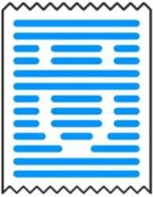

# UCheck
<!-- Badges -->
[](https://github.com/DLochmelis33/UCheck/blob/master/CHANGELOG.md)
[![License Badge][license-badge]][license]
[](https://github.com/DLochmelis33/UCheck/actions/workflows/on_push.yml)
[](https://github.com/DLochmelis33/UCheck/graphs/contributors)

## Introduction
UCheck is created to help people buy a variety of goods at the lowest prices. 

### What can you do with UCheck?
* Scan your check after shopping
* Agregate all purchase information (prices, items, shop, etc) in UCheck database
* Use the collected information to find necessary goods at the lowest prices

For more information visit our [project wiki](https://github.com/DLochmelis33/UCheck/wiki)!

## Installation

1. Clone the repo: 
```bash
git clone git@github.com:DLochmelis33/UCheck.git
cd UCheck
```

2. Execute Gradle
```bash
./gradlew build
```

### Installing with Docker

1. Clone the repo (just like normal installation)

1. To assemble project into JAR, build an image using `assemble.Dockerfile`:
```bash
 docker build -t ucheck:assemble . -f dockerfiles/assemble.Dockerfile
```
The TAR and ZIP archives containing an executable JAR are located in the `build/distributions` folder in the `ucheck:build-and-test` image.

1. To run tests, build an image using `build-and-test.Dockerfile`:
```bash
 docker build -t ucheck:test . -f dockerfiles/build-and-test.Dockerfile
```
This command generates TAR and ZIP archives as well.

## Authors
- Gleb Solovev ([@GlebSolovev](https://github.com/GlebSolovev))
- Denis Lochmelis ([@DLochmelis33](https://github.com/DLochmelis33))
- Ekaterina Itsenko ([@Soykaa](https://github.com/Soykaa))

## Acknowledgements
We are [very very a lot super mega] grateful to our wonderful teachers for their support and assistance during the whole project:
- Vladislav Tankov
- Timofey Bryksin

## Contribute
Contributions are welcome! Before creating a pull request, make sure that it adheres to the following guidelines:

- Avoid duplicates: search previous suggestions before making a new one
- Make an individual pull request for each suggestion
- Keep descriptions short and simple, but descriptive

Thank you!
## Links
* [Project Roadmap](https://github.com/DLochmelis33/UCheck/projects/1)
* [Open issues](https://github.com/DLochmelis33/UCheck/issues)

[license]: ./LICENSE.txt
[license-badge]: https://badgen.net/badge/license/GNU%20Affero%20General%20Public%20License%20v3.0
