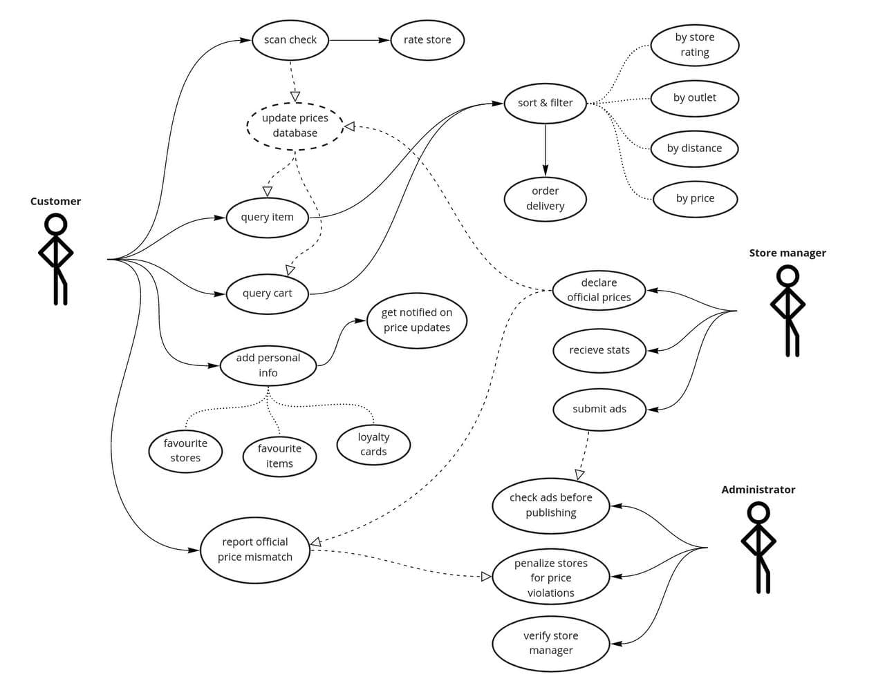

# Requirements

## User-case diagram

_Comment:_
- _solid lines &mdash; sequential user actions_
- _dashed lines &mdash; implicit interaction_
- _dotted lines &mdash; options_

## User stories

1. As an administrator, I want to ban inappropriate ads so that users don’t get offended and stop using our app.

1. As a store manager, I want to publish current prices in my store so that more customers visit my store.

1. As a customer, I want to know about the best prices and discounts in different stores so that I can save money.

## Job stories

1. When I am too tired to walk far, I want to filter stores by both price and distance so I can find the nearest store with acceptable prices.

1. When prices for my favorite item drop, I want to get notified about it as soon as possible, so I can catch it at a better price before it goes out of stock.

1. When I make a purchase in a store, I want to scan my check so I can access current prices and discounts information from checks of other people.