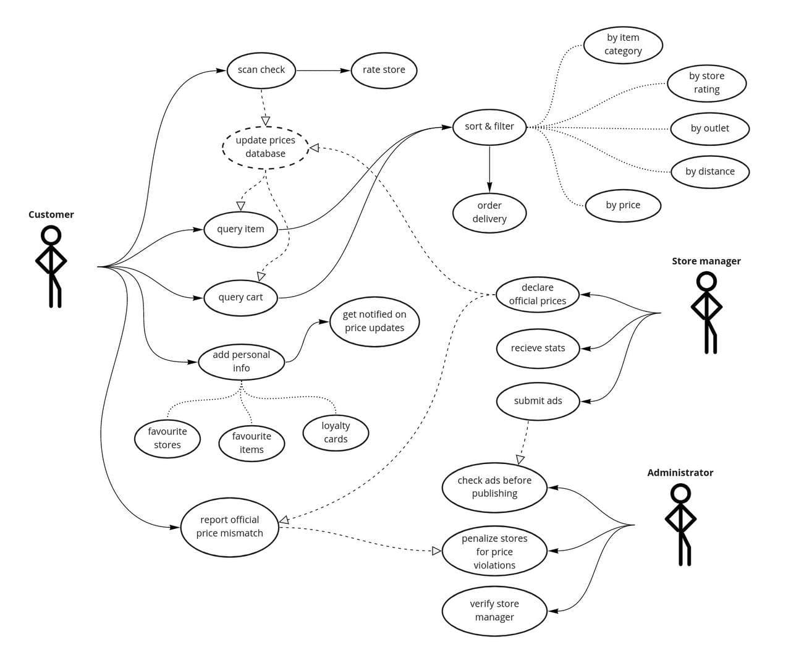

# Requirements

## User roles
### Customer
1. can scan checks
    * mark whether he used a loyalty card or other promotions

2. can look at prices in our aggregator (in a variety of formats)
    * find the lowest price for a product or for an entire cart of products
    * filter or sort products by available parameters:
        * item category
        * store rating
        * outlet
        * distance
        * price
    * order a delivery using a third-party service

3. can rate a store after scanning a check from it
    * can report a store violating their official prices by scanning a check

4. can upload information about themselves
    * favorite products, stores
    * loyalty card information

6. can subscribe for updates of favorite stores and / or monitor favorite products

### Store manager
1. can load goods prices into app, including some special terms (loyalty card discounts, promotions, etc)
    * each uploaded price has a validity period, during which the store is required to comply with it
2. can get statistics of those users who scanned check in the store
3. can purchase ads

### Administrator
1. verifies ads before publication
2. can verify a store manager (i.e. create an account)
3. can apply sanctions to the stores that provide wrong official prices

## User-case diagram

_Comment:_
- _solid lines — sequential user actions_
- _dashed lines — implicit interaction_
- _dotted lines — options_

## User stories

1. As an administrator, I want to ban inappropriate ads so that users don’t get offended and stop using our app.

1. As a store manager, I want to publish current prices in my store so that more customers visit my store.

1. As a customer, I want to know about the best prices and discounts in different stores so that I can save money.

## Job stories

1. When I am too tired to walk far, I want to filter stores by both price and distance so I can find the nearest store with acceptable prices.

1. When prices for my favorite item drop, I want to get notified about it as soon as possible, so I can catch it at a better price before it goes out of stock.

1. When I make a purchase in a store, I want to scan my check so I can access current prices and discounts information from checks of other people.